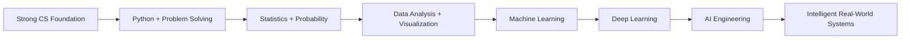

<!--
  GitHub Profile README for Efti6181
  Portfolio-style • Recruiter-friendly • AI/ML & Data Science focused
-->

<div align="center">


<a href="https://github.com/Efti6181">
  
</a>

<br/>


<a href="https://github.com/Efti6181?tab=followers">
  
</a>

</div>

---

## 👨‍💻 About Me

```yaml
name: Najmul Alam Efti
username: Efti6181
role: CSE Student & Software Developer
location: Bangladesh

currently_building:
  - StudyPilot — Academic Success Platform
  - Backend APIs & Database-driven Applications
  - AI-assisted Academic Features
  - Android Applications

interests:
  - Artificial Intelligence
  - Machine Learning
  - Data Science
  - Software Engineering
  - Backend Development
  - Android Development
  - Cybersecurity

career_direction:
  - Become an AI / ML Engineer
  - Build intelligent and data-driven software
  - Develop strong Data Science and Machine Learning expertise
  - Work on real-world AI products and intelligent systems
```

I am a **Computer Science & Engineering student** who enjoys transforming ideas into practical software solutions.

My experience spans **ASP.NET Core MVC, Python/FastAPI, Android/Kotlin, databases, artificial intelligence algorithms, web development, computer networks, cybersecurity fundamentals, and software engineering**.

My long-term goal is to build a career in **Artificial Intelligence, Machine Learning, and Data Science**, while continuing to strengthen my foundation in software engineering and backend development.

I am particularly interested in developing systems that are **intelligent, scalable, maintainable, secure, and useful in real-world environments**.

---

## 🚀 Current Mission

<table>
<tr>
<td width="50%" valign="top">

### 🎓 Building

- **StudyPilot** academic success platform
- Role-based systems for **Student / Faculty / Admin**
- Secure authentication & authorization
- PostgreSQL-backed application modules
- AI-assisted academic planning
- REST APIs and backend applications
- Modern Android applications

</td>

<td width="50%" valign="top">

### 🌱 Learning Next

- Machine Learning fundamentals
- Data preprocessing & feature engineering
- NumPy & Pandas
- Data visualization
- Statistics & probability
- Scikit-learn
- Model evaluation
- Deep Learning fundamentals

</td>
</tr>
</table>

---

# 🛠️ Tech Arsenal

<div align="center">

### Languages


### Frameworks & Development


### Databases, Tools & Platforms


</div>

<br/>

### 💡 Engineering Concepts I Work With

`OOP` • `MVC` • `MVVM` • `REST APIs` • `ASP.NET Core Identity` • `Entity Framework Core` • `Authentication` • `Authorization` • `PostgreSQL` • `Firebase Realtime Database` • `Room` • `Retrofit` • `Hilt` • `Git/GitHub` • `Data Structures` • `Search Algorithms` • `Minimax` • `Alpha-Beta Pruning` • `Computer Networks` • `Cybersecurity Fundamentals`

### 🤖 AI / ML & Data Science Focus


---

# 🌟 Featured Projects

<table>
<tr>
<td width="50%" valign="top">

## 🚀 StudyPilot

**University Academic Success Platform**

A growing ASP.NET Core MVC application designed for students, faculty, and administrators.

**Highlights**

- ASP.NET Core MVC
- C#
- PostgreSQL
- Entity Framework Core
- ASP.NET Core Identity
- Student / Faculty / Admin roles
- Academic modules
- Community, Events & Notifications
- AI-assisted academic features

<a href="https://github.com/Efti6181/StudyPilot">
  
</a>

</td>

<td width="50%" valign="top">

## ♟️ Stratego Duel AI

**Adversarial AI Game**

A Python/Pygame strategy game featuring an AI opponent built with classic adversarial search techniques.

**Highlights**

- Python
- Pygame
- Minimax
- Alpha-Beta Pruning
- Evaluation Function
- Game State Search
- AI Decision Making

<a href="https://github.com/Efti6181/STRATEGO-DUEL-AI-GAME">
  
</a>

</td>
</tr>

<tr>
<td width="50%" valign="top">

## 📱 Android News App

**Modern Android Application**

A structured Android project built using modern Android architecture and development practices.

**Highlights**

- Kotlin
- Jetpack Compose
- MVVM
- Room
- Retrofit
- Hilt
- API Integration

<a href="https://github.com/Efti6181/Android-News-App">
  
</a>

</td>

<td width="50%" valign="top">

## ⚡ Bookshop API

**REST API with FastAPI**

A Python backend project focused on API design, validation, models, and REST development fundamentals.

**Highlights**

- Python
- FastAPI
- Pydantic
- REST API
- CRUD Concepts
- HTTP Status Handling

<a href="https://github.com/Efti6181/Bookshop-api">
  
</a>

</td>
</tr>
</table>

---

## 🧩 More Projects

| Project | Focus | Repository |
|---|---|---|
| 🎓 **University Management System** | PHP, MySQL, role-based academic management | [Explore](https://github.com/Efti6181/University_Management_System) |
| 📄 **PUC Cover Page Generator** | Web automation, HTML/CSS/JS | [Explore](https://github.com/Efti6181/PUC_Cover_Page_Generator) |
| 📚 **Library Management System** | Java, OOP, Swing | [Explore](https://github.com/Efti6181/Library_Management_System) |
| 🤖 **IoT Fire Fighting Robot** | IoT, embedded systems, robotics | [Explore](https://github.com/Efti6181/IOT_Fire_Fighting_Robot) |
| 🧠 **Deadlock Detection Simulator** | Operating systems concepts | [Explore](https://github.com/Efti6181/Deadlock-Detection-Simulator) |
| 📝 **Android Notes App** | Kotlin, Compose, Room | [Explore](https://github.com/Efti6181/Android-Notes-App) |
| 🛒 **Android E-Commerce App** | Mobile application development | [Explore](https://github.com/Efti6181/Android-E-Commerce-App) |
| ✅ **Task Management API** | Backend API development | [Explore](https://github.com/Efti6181/Task_Management_API) |
| 📊 **OBE CGPA Calculator** | Academic utility application | [Explore](https://github.com/Efti6181/OBE_CGPA_Calculator) |
| 💰 **Personal Expense Tracker** | Data handling & application logic | [Explore](https://github.com/Efti6181/Personal-Expense-Tracker) |
| 📈 **Data Science Practice** | Data analysis & learning | [Explore](https://github.com/Efti6181/Data-Science-CWH) |

---

# 🧠 AI & Computer Science

<div align="center">

```text
Artificial Intelligence
├── BFS
├── DFS
├── Uniform Cost Search
├── Greedy Best-First Search
├── A*
├── Minimax
├── Alpha-Beta Pruning
└── Heuristic Evaluation

Data Science Foundations
├── Python
├── NumPy
├── Pandas
├── Matplotlib
├── Probability
├── Statistics
└── Exploratory Data Analysis

Software Engineering
├── Object-Oriented Programming
├── MVC / MVVM
├── Authentication & Authorization
├── REST API Design
├── Database Integration
├── Git Version Control
└── Modular Application Architecture
```

</div>

---

# 🎓 Learning & Certifications

<div align="center">

<a href="https://github.com/Efti6181/CS50X_2026">
  
</a>

<a href="https://github.com/Efti6181/CS50P">
  
</a>

<a href="https://github.com/Efti6181/CS50AI">
  
</a>

</div>

<br/>

- ✅ **CS50x — Introduction to Computer Science**
- ✅ **CS50P — Introduction to Programming with Python**
- ✅ **CS50AI — Introduction to Artificial Intelligence with Python**
- ✅ **HarvardX — Fat Chance: Probability from the Ground Up**
- ✅ **Computer Science for Artificial Intelligence**
- 📚 Continuing toward **Machine Learning & Data Science**

---

# 📊 GitHub Analytics

<div align="center">


<br/>


<br/><br/>


</div>

---

# 📈 Contribution Activity

<div align="center">


</div>

---

# 🎯 AI / ML & Data Science Roadmap



### Current Learning Path

`Python` → `NumPy` → `Pandas` → `Statistics` → `Data Visualization` → `Scikit-learn` → `Machine Learning` → `Deep Learning` → `AI Engineering`

---

# 🤝 Let's Build Something Meaningful

I enjoy collaborating on projects involving:

- 🤖 Artificial Intelligence
- 🧠 Machine Learning
- 📊 Data Science
- 💻 Software Engineering
- ⚡ Backend APIs
- 📱 Android Development
- 🎓 Educational Technology
- 🔐 Secure and intelligent software systems

<div align="center">

<a href="https://github.com/Efti6181">
  
</a>

<br/><br/>

### `Learn. Build. Analyze. Improve. Repeat.`


</div>
